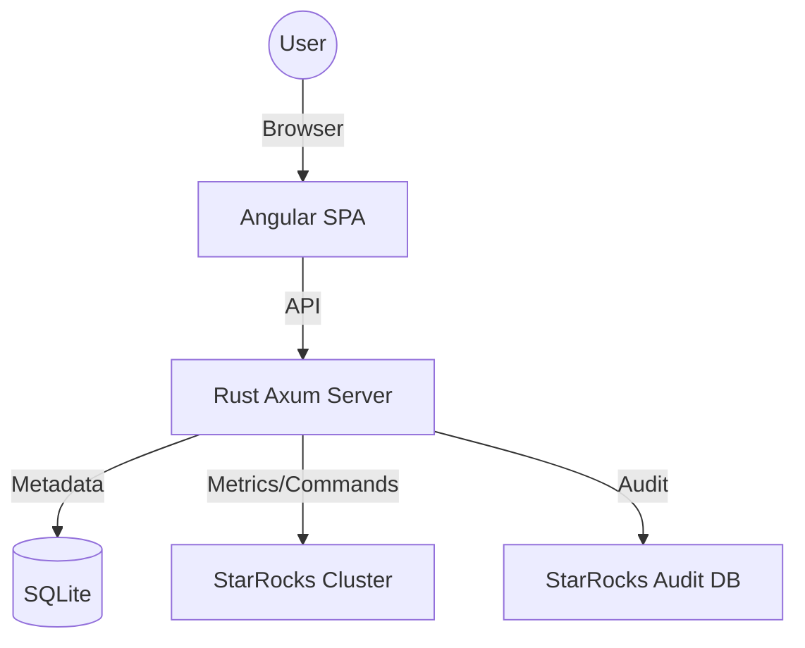
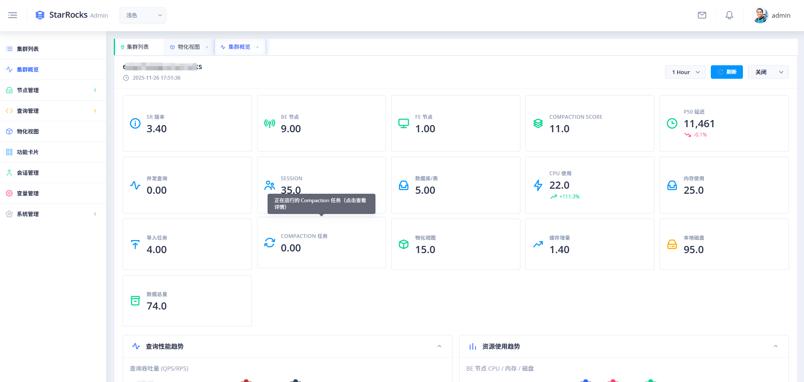
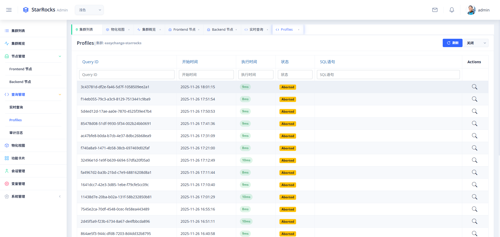

# StarRocks Admin

<div align="center">


本项目基于开源项目https://github.com/jlon/starrocks-admin修改，将sqlite修改为mysql，增加了值班管理、资源管理、告警管理模块。

</div>

---

## 📖 简介
**StarRocks Admin** 是专为 StarRocks 数据库设计的企业级管理工具。它通过直观的 Web 界面，为 DBA 和开发人员提供了强大的集群管理、实时监控、查询分析及安全管控能力。

本项目采用前沿的技术栈构建：
- **后端**: 使用 **Rust (Axum)** 异步框架，提供极致的性能和内存安全。
- **前端**: 基于 **Angular** 与 **Nebular** UI 体系，打造流畅且美观的交互体验。

## ✨ 核心特性

- **🚀 一键部署**：完美支持 Docker、Kubernetes (Helm) 及传统脚本部署。
- **📊 实时深度监控**：全方位展示 FE/BE 节点状态、CPU/内存/磁盘及网络负载趋势。
- **🔍 查询洞察与分析**：支持实时查询监控、SQL 审计日志、以及可视化的 Query Profile 性能调优。
- **🔒 企业级安全**：集成 RBAC 权限体系、JWT 认证，提供精细化的操作审计。
- **🛠️ 辅助管理工具**：内置在线 SQL 编辑器、变量管理、用户角色管控等功能。

## 🚀 快速开始


```bash
# 1. 克隆仓库
git clone https://github.com/annoymous/starrocksadmin.git
cd starrocksadmin

# 2. 一键构建 (需要 Rust 和 Node.js 环境)
make build

# 3. 启动应用
./build/dist/bin/starrocks-admin.sh start
```

## 🏗️ 核心架构

StarRocks Admin 采用前后端分离的现代化架构，后端将前端资源打包嵌入，实现单二进制文件快速部署。



## 🖥️ 界面预览

|  |  |
| :---: | :---: |
| **集群监控面板** | **SQL 性能剖析** |

## 🛠️ 配置说明

### 权限初始化
在将 StarRocks 集群接入平台前，建议创建一个具备只读权限的专用监控用户：

```sql
-- 创建账户
CREATE USER 'sr_admin_monitor'@'%' IDENTIFIED BY 'your_password';
-- 授予权限（详细请参考 docs/permissions.md）
GRANT SELECT, USAGE ON *.* TO 'sr_admin_monitor'@'%';
```

### 主配置文件 (`conf/config.toml`)
```toml
[server]
port = 8080

[database]
url = "sqlite://data/starrocks-admin.db"

[auth]
jwt_secret = "your-custom-secret-key"
```
